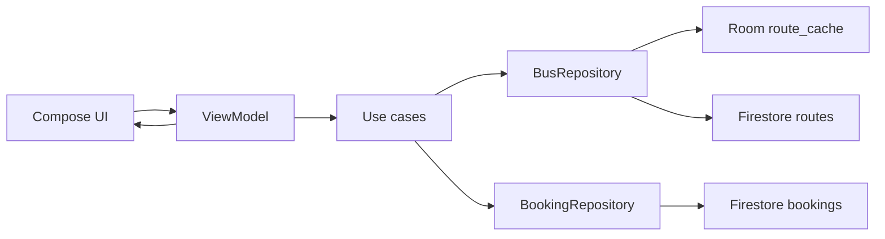

# NexiRide2

Intercity bus discovery, booking, and ticket management for Android (Jetpack Compose).

This document maps the project to typical **mobile computing coursework deliverables** (overview, architecture, data, sensors, UI).

---

## 1. Project overview

**Problem statement**  
Many travelers still rely on informal channels for intercity buses: schedules and seat availability are unclear, tracking a trip is hard, and tickets are not always available when the network drops. NexiRide2 is a prototype that centralizes search and booking, shows a live map for an active trip, and keeps PDF tickets on device after download.

**Target audience**  
Passengers using **Android phones** (minSdk 24), including **mid-range devices** and users with **intermittent mobile data**. The app avoids assuming a always-on connection by caching route search results and storing downloaded ticket PDFs locally.

---

## 2. System architecture

**Design pattern: MVVM**  
Compose **screens** observe **ViewModels** (`SearchViewModel`, `LiveTrackingViewModel`, etc.). ViewModels call **use cases** and **repository interfaces** in the **domain** layer. **Data** implements repositories: **Firebase Firestore** for routes, bookings, seats, profiles, payment methods, and in-app notifications; **Firebase Authentication** (email/password) for sign-in; **Room** for on-device route cache and downloaded ticket PDFs. **Dependency injection** is Hilt.

**Architecture diagram (data flow)**



**External APIs and services**

| Service | Role |
|--------|------|
| **Google Maps SDK / Maps Compose** | Map and markers on live tracking; **Google Play Services Location (Fused)** for GPS updates. |
| **Retrofit + OkHttp** | Generic **`NetworkModule`** client (placeholder base URL); not used for the main booking flow. |
| **Firebase Firestore** | Collections **`routes`** (with **`seats`** subcollection), **`bookings`**, **`cities`**, **`users`** (with **`payment_methods`** subcollection), **`notifications`**. See **`firestore.rules`**. Debug **`FirestoreSeed`** fills empty **routes**, **cities**, and **seats** from bundled `MockData`. **Bookings** require a signed-in **Firebase Auth** user. |
| **Firebase Auth** | Wired via **`FirebaseAuthRepository`** (email/password, password reset email, profile fields mirrored in **`users/{uid}`** on sign-up). |

---

## 3. Data management

**Local persistence (Room)**

| Table | Purpose |
|-------|---------|
| `downloaded_tickets` | `bookingId`, `referenceCode`, `createdAtEpochMs`, `pdfPath` — offline PDF ticket files. |
| `route_cache` | `cacheKey`, `routesJson`, `updatedAtEpochMs` — cached **route lists** (search + popular routes) as JSON. |

**Sync / offline strategy: cache-then-network (with offline read)**  

- **Online:** `CachingBusRepository` calls **`FirestoreBusRepository`**, then **writes** the JSON payload to `route_cache` under a stable key (e.g. `search:origin|destination|date|passengers` or `cache:popular_routes`).  
- **Offline:** If `ConnectivityManager` reports no usable network, search loads **only** from `route_cache` for that key; if nothing was cached yet, the user sees a clear error asking them to search once while online.  
- **PDF tickets:** `DownloadedTicketRepositoryImpl` writes files and metadata so tickets stay usable without refetching the booking.

*(Room schema version was bumped; debug builds use destructive migration—fine for class demos; production would ship proper migrations.)*

---

## 4. Hardware and sensor integration

At least **three** sensors are used, with processing as follows.

| Sensor | Where | Raw signal → logic → effect |
|--------|--------|-----------------------------|
| **GPS (Fused Location Provider)** | Live tracking | `LocationCallback` receives lat/long → `LatLng` in `LiveTrackingViewModel` → **user marker** on the map and **haversine** straight-line **distance (km)** to the simulated bus position. |
| **Accelerometer** | Search | `SensorManager` `TYPE_ACCELEROMETER` → `ShakeDetector` compares successive acceleration magnitudes; when **jerk** exceeds a threshold and **cooldown** elapsed → triggers **`SearchViewModel.search()`** (shake to refresh). |
| **Proximity** | Ticket detail | `TYPE_PROXIMITY` distance vs `maximumRange` (binary on some devices) → **“near”** state → **QR and share actions hidden** and a privacy overlay shown (e.g. phone near face / in pocket). |

**Permissions:** `ACCESS_FINE_LOCATION` and `ACCESS_COARSE_LOCATION` for fused location on the tracking screen.

---

## 5. User interface design

**Wireframes / screenshots**  
Attach **your own** screenshots from the emulator or device: Splash, Home, Search, Results, Seat selection, Ticket (with QR), Live tracking map, Profile.

**Responsiveness**  
Layouts use **Compose `dp`** and flexible modifiers (`fillMaxWidth`, `weight`, scroll) so density scales correctly. **No activity-level orientation lock**—the UI reflows in landscape where scrollable content allows. For the coursework write-up, note that **Material 3** spacing and type scales with system font/size settings where applicable.

---

## Firebase setup

1. Create a project in the [Firebase Console](https://console.firebase.google.com/), add an **Android** app with package **`com.example.nexiride2`**, and download **`google-services.json`** into the **`app/`** module (replace the placeholder file in the repo if present).
2. Enable **Authentication → Sign-in method → Email/Password**.
3. Create a **Cloud Firestore** database (start in test mode if you like, then deploy rules). Copy **`firestore.rules`** from this repo and run **`firebase deploy --only firestore:rules`** (or paste the rules in the console). The committed rules are **dev-oriented** (open writes on **`routes`** / **`cities`** / **`seats`** so the in-app debug seed can run before sign-in); **tighten** these before any production release.
4. **Debug auto-seed:** On first **debug** launch, **`FirestoreSeed`** fills empty **`routes`**, **`cities`**, and per-route **`seats`** from bundled `MockData`. **Bookings** are not seeded; they are created when a signed-in user completes checkout.
5. **Payments:** Saved cards/MoMo entries in Firestore are app-side metadata only. Integrating **Paystack / Stripe** still requires your backend for client secrets and webhooks.
6. **Push (FCM):** In-app notifications load from Firestore. Add **FCM** if you need push when the app is closed.

---

## Build

Requires Android SDK and a **full JDK 17+** (with `jlink`), not a minimal JRE. From project root:

```bash
./gradlew assembleDebug
```

**If the build fails with `jlink ... does not exist` (often under a `.cursor` or VS Code Java extension path):**

1. **Android Studio:** **Settings → Build, Execution, Deployment → Gradle → Gradle JDK** → choose **Project SDK** or **Embedded JDK** (not a “JRE” from another editor).
2. This repo pins **`.idea/gradle.xml` → Gradle JDK** to **`/Library/Java/JavaVirtualMachines/jdk-21.jdk/Contents/Home`** (full JDK with `jlink`). On **Windows/Linux**, edit that path to your JDK, or install JDK 21 at the same macOS path if you use a Mac.
3. **Command line:** ensure `JAVA_HOME` points to a full JDK, or rely on `org.gradle.java.home` in **`gradle.properties`** (macOS path there is an example—adjust or remove if you use Windows/Linux).

Set a valid **Google Maps API key** in `app/src/main/res/values/strings.xml` (`google_maps_key`).

---

## Demo tips (sensors & offline)

1. **Shake:** On Search, pick origin/destination, then **shake** the device/emulator to run search again.  
2. **Offline cache:** While online, run a search once; enable **airplane mode**; search the **same** route again — cached results appear with a **cache hint** banner.  
3. **GPS:** Open **Live tracking**, grant location — your position appears as **“Your location (GPS)”** and distance updates vs the bus.  
4. **Proximity:** On **Ticket details**, cover the top of the phone (proximity sensor) — QR is **masked** until you move the phone away.
